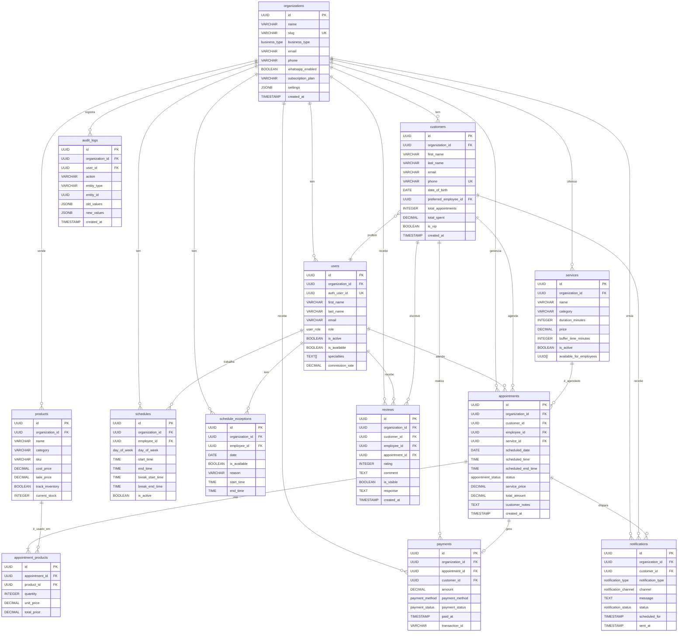

# Diagrama Entidade-Relacionamento (ER)

## Estrutura Completa do Banco de Dados



## Relacionamentos Principais

### 1. Multi-Tenancy
- Todas as tabelas principais têm `organization_id`
- RLS garante isolamento de dados

### 2. Agendamento
```
customer → appointment ← employee
           ↓
         service
           ↓
      appointment_products ← product
```

### 3. Pagamento
```
appointment → payment ← customer
```

### 4. Notificações
```
appointment → notification → customer
```

### 5. Horários
```
organization → schedules ← employee
organization → schedule_exceptions ← employee
```

## ENUMs Utilizados

### business_type
- beauty_salon
- barber_shop
- spa
- clinic
- gym
- studio
- other

### appointment_status
- pending
- confirmed
- in_progress
- completed
- cancelled
- no_show

### payment_status
- pending
- paid
- partially_paid
- refunded
- cancelled

### payment_method
- cash
- credit_card
- debit_card
- pix
- bank_transfer
- other

### notification_type
- appointment_created
- appointment_confirmed
- appointment_reminder
- appointment_cancelled
- payment_received
- birthday
- promotional
- system

### notification_channel
- email
- sms
- whatsapp
- push

### user_role
- super_admin
- owner
- manager
- employee
- receptionist

### day_of_week
- monday
- tuesday
- wednesday
- thursday
- friday
- saturday
- sunday

## Índices Importantes

### Performance
- `idx_appointments_scheduled_datetime` - Buscar agendamentos por data/hora
- `idx_customers_phone` - Buscar clientes por telefone
- `idx_appointments_organization_id` - Filtrar por organização

### Multi-Tenancy
- Todos os `organization_id` têm índice
- RLS usa esses índices para performance

### Busca
- `idx_customers_tags` (GIN) - Busca por tags
- Índices em `email`, `phone`, `cpf`

## Views

### customer_statistics
Estatísticas agregadas por cliente:
- Total de agendamentos
- Agendamentos completos/cancelados
- Total gasto
- Avaliação média

### daily_appointments
Dashboard de agendamentos do dia:
- Informações completas
- Nome do cliente
- Nome do funcionário
- Serviço
- Status

## Triggers Ativos

1. **update_updated_at_column** - Atualiza `updated_at` automaticamente
2. **create_audit_log** - Cria logs de auditoria
3. **update_customer_statistics** - Atualiza estatísticas do cliente
4. **validate_appointment_availability** - Valida conflitos de horário
5. **calculate_appointment_end_time** - Calcula horário de término
6. **update_product_inventory** - Atualiza estoque automaticamente
7. **create_appointment_reminder_notification** - Cria lembretes automáticos

## Functions Úteis

### get_available_time_slots
Retorna horários disponíveis para agendamento.

**Parâmetros:**
- organization_id
- employee_id
- service_id
- date

**Retorna:** Lista de slots com disponibilidade

### get_next_available_dates
Busca próximas datas disponíveis.

**Parâmetros:**
- organization_id
- employee_id
- service_id
- days_ahead (padrão: 30)

**Retorna:** Datas com número de slots disponíveis

### get_dashboard_metrics
Retorna métricas do dashboard.

**Parâmetros:**
- organization_id
- start_date
- end_date

**Retorna:** JSON com métricas agregadas
